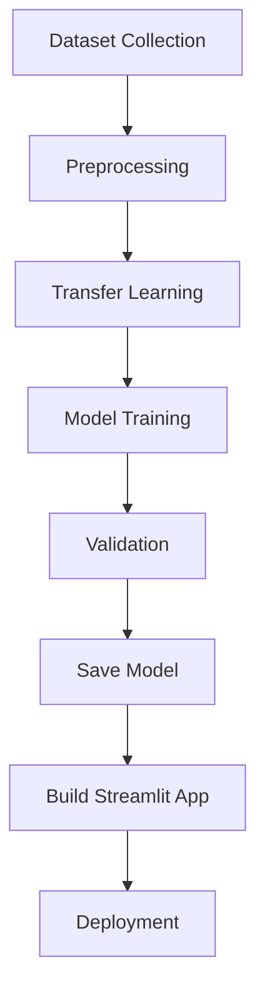
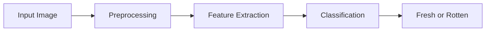

#  Smart Food Quality Checking using Deep Learning

<p align="center">
  
  
  
  
</p>

<p align="center">
An AI-powered food freshness detection system that classifies fruits and vegetables as <b>Fresh ✅</b> or <b>Rotten ❌</b> using Deep Learning and Computer Vision.
</p>

---

# Live Deployment

 **Try the application here**

**🔗 [Live Demo](ai-based-food-quality-checking.vercel.app)**

---

#  Abstract

Food quality assessment plays a crucial role in ensuring consumer health and reducing food wastage. Traditional food inspection methods rely heavily on manual examination, which is time-consuming, subjective, and prone to human error.

This project presents an AI-based food quality checking system that utilizes deep learning techniques to automatically classify fruits and vegetables as fresh or rotten. The proposed system employs transfer learning using the MobileNetV2 architecture to perform image classification across 28 classes, comprising 14 fresh and 14 rotten categories of fruits and vegetables.

The trained model achieved a validation accuracy of **96.67%**, demonstrating strong performance in identifying food quality. The model was integrated into a Streamlit web application to provide real-time food quality assessment.

---

# 1️.Introduction

Food spoilage is a major global issue contributing to economic loss, food wastage, and health risks. Early detection of spoiled food can improve food safety standards and reduce unnecessary waste.

This project focuses on developing an intelligent image-based food quality detection system capable of distinguishing between fresh and rotten fruits and vegetables using deep learning.

### Project Objectives

* Detect food freshness automatically
* Reduce food wastage
* Improve food safety
* Reduce manual inspection dependency
* Provide real-time prediction

---

##  Project Overview Flowchart


---

# 2️. Literature Review

Several studies have explored machine learning techniques for food quality detection.

### Traditional Approaches

Traditional food quality inspection depends on:

* Manual visual examination
* Chemical testing
* Sensor-based monitoring

### Limitations

* Time-consuming
* High labor dependency
* Human error possibility
* Difficult to scale

### Machine Learning Approaches

Previous systems used:

* Color feature extraction
* Texture analysis
* Shape descriptors
* Support Vector Machines (SVM)

These approaches often struggled under varying environmental conditions.

### Deep Learning Approaches

Recent solutions use CNN architectures such as:

* ResNet
* EfficientNet
* VGG16
* MobileNet

MobileNetV2 provides better speed, efficiency, and lightweight deployment.

---

## Comparison with Existing Systems

| Feature                | Traditional Systems | Existing CNN Models | Proposed System |
| ---------------------- | ------------------- | ------------------- | --------------- |
| Manual Inspection      | Yes                 | No                  | No              |
| Real-Time Detection    | No                  | Limited             | Yes             |
| Accuracy               | Medium              | Good                | **96.67%**      |
| Lightweight Deployment | No                  | Moderate            | Yes             |
| Web Deployment         | No                  | Limited             | Yes             |

### Why This Project is Better

* Lightweight MobileNetV2 architecture
* Higher validation accuracy (**96.67%**)
* Faster prediction speed
* Real-time Streamlit deployment
* Lower computational cost

---

# 3️. Methodology

## 3.1 Dataset Collection

The dataset contains images of 14 fruits and vegetables divided into fresh and rotten categories.

### Categories

* Apple
* Banana
* Bell Pepper
* Carrot
* Cucumber
* Grape
* Guava
* Jujube
* Mango
* Orange
* Pomegranate
* Potato
* Strawberry
* Tomato

Total Classes:

**28 Classes = 14 Fresh + 14 Rotten**

---

## 3.2 Data Preprocessing

The following preprocessing steps were applied:

* Resize images to **224 × 224 pixels**
* Train-validation split (**80:20**)
* Normalize pixel values
* Batch processing with size **32**
* Data augmentation

---

## 3.3 Model Architecture

The project uses **MobileNetV2** with pretrained ImageNet weights.

Custom layers:

* Global Average Pooling Layer
* Dense Layer (128 neurons, ReLU)
* Dropout Layer (0.3)
* Softmax Output Layer

Base MobileNetV2 layers were frozen during training.

---

##  Architecture Diagram

```text id="b2"
Input Image
      │
      ▼
Image Preprocessing
(Resize + Normalize)
      │
      ▼
MobileNetV2 Base Model
(Feature Extraction)
      │
      ▼
Global Average Pooling
      │
      ▼
Dense Layer (128)
      │
      ▼
Dropout Layer (0.3)
      │
      ▼
Softmax Output Layer
      │
      ▼
Prediction Output
```

---

# 4️. Implementation

### Tools & Technologies Used

* Python
* TensorFlow
* MobileNetV2
* Streamlit
* Google Colab
* NumPy
* Pillow
* JSON
* GitHub

### Development Environment

* Model Training → Google Colab
* Deployment → Streamlit Community Cloud
* Version Control → GitHub

---

## ⚙ Implementation Pipeline



---

# 5️. Results

The trained model demonstrated strong classification performance.

### Performance Metrics

| Metric              | Value           |
| ------------------- | --------------- |
| Validation Accuracy | **96.67%**      |
| Number of Classes   | **28**          |
| Input Size          | **224 × 224**   |
| Model               | **MobileNetV2** |

### Observed Results

* Accurate fresh vs rotten classification
* Fast prediction speed
* Strong model generalization
* Lightweight deployment model

---

## 📈 Prediction Workflow



---

# 6️. Limitations

Current limitations include:

* Performance decreases in poor lighting conditions
* Limited to 14 fruit and vegetable categories
* Complex backgrounds may reduce prediction accuracy
* Cannot estimate spoilage severity
* Requires clear image input

---

# 7️. Future Scope

The project can be improved by:

* Adding more food categories
* Multi-object detection in one image
* Mobile app deployment
* IoT sensor integration
* Cloud deployment
* Explainable AI implementation
* Spoilage percentage estimation

---

##  Future System Expansion


---

# 8️. Conclusion

This project successfully developed an AI-based food quality checking system capable of identifying fresh and rotten fruits and vegetables using deep learning and transfer learning.

By implementing MobileNetV2 and deploying the model through a Streamlit application, the system provides an efficient and scalable solution for automated food quality assessment.

The achieved validation accuracy of **96.67%** demonstrates the effectiveness of AI in improving food safety standards while reducing food wastage.

---

# 9️. References

1. MobileNetV2 Research Paper (Google Research)
2. TensorFlow Documentation
3. Streamlit Documentation
4. Kaggle Dataset Repository
5. Deep Learning Research Papers

---

#  Installation

Clone repository

```bash id="f6"
git clone https://github.com/KhushiBonde/-AI-based-Food-Quality-checking.git
```

Install dependencies

```bash id="g7"
pip install -r requirements.txt
```

Run locally

```bash id="h8"
streamlit run app.py
```

---

<p align="center">
⭐ If you found this project interesting, consider starring the repository.
</p>
