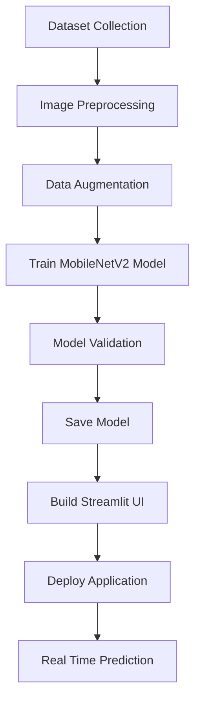

# 🍎 Smart Food Quality Checking using Deep Learning

<p align="center">
  
  
  
  
</p>

<p align="center">
AI-powered food freshness detection system that classifies fruits and vegetables as <b>Fresh ✅</b> or <b>Rotten ❌</b> using Deep Learning.
</p>

---

## 📌 Overview

Food quality inspection is an important part of food safety and reducing waste. Traditional inspection methods rely on manual checking, which can be slow and inconsistent.

This project uses **Computer Vision + Deep Learning** to automatically analyze images of fruits and vegetables and classify them as **Fresh** or **Rotten**.

The model is trained using **Transfer Learning (MobileNetV2)** and deployed through an interactive **Streamlit web application** for real-time predictions.

---

## 🚀 Demo Workflow

```text
User Uploads Image
        │
        ▼
Image Preprocessing
(Resize → Normalize)
        │
        ▼
MobileNetV2 Model
(Feature Extraction)
        │
        ▼
Classification Layer
(28 Classes)
        │
        ▼
Prediction Result
Fresh ✅ / Rotten ❌
```

---

## 🏗 System Architecture

```text
                    ┌──────────────────────┐
                    │   Input Food Image   │
                    └──────────┬───────────┘
                               │
                               ▼
                    ┌──────────────────────┐
                    │ Image Preprocessing  │
                    │ Resize + Normalize   │
                    └──────────┬───────────┘
                               │
                               ▼
                    ┌──────────────────────┐
                    │  MobileNetV2 Model   │
                    │ Feature Extraction   │
                    └──────────┬───────────┘
                               │
                               ▼
                    ┌──────────────────────┐
                    │ Dense + Dropout      │
                    │ Classification Layer │
                    └──────────┬───────────┘
                               │
                               ▼
                    ┌──────────────────────┐
                    │ Prediction Output    │
                    │ Fresh / Rotten       │
                    └──────────────────────┘
```

---

## 🎯 Problem Statement

Food spoilage leads to:

* Huge economic losses
* Increased food wastage
* Poor food safety standards
* Health risks from spoiled food consumption

The goal is to build an **automated AI system** capable of detecting food freshness quickly and accurately.

---

## 🧠 Model Details

This project uses **Transfer Learning** with **MobileNetV2**.

### Model Architecture

* Pretrained MobileNetV2 (ImageNet weights)
* Global Average Pooling Layer
* Dense Layer (128 neurons, ReLU)
* Dropout Layer (0.3)
* Softmax Output Layer

### Why MobileNetV2?

✔ Lightweight architecture
✔ Faster inference time
✔ High accuracy
✔ Suitable for deployment
✔ Optimized for real-time applications

---

## 📂 Dataset

The dataset contains **14 fruits and vegetables**, each divided into **Fresh** and **Rotten** classes.

### Categories

* Apple
* Banana
* Bell Pepper
* Carrot
* Cucumber
* Grape
* Guava
* Jujube
* Mango
* Orange
* Pomegranate
* Potato
* Strawberry
* Tomato

Total Classes:

**28 Classes = 14 Fresh + 14 Rotten**

---

## ⚙ Project Pipeline



---

## 💻 Tech Stack

| Technology   | Purpose              |
| ------------ | -------------------- |
| Python       | Programming          |
| TensorFlow   | Deep Learning        |
| MobileNetV2  | Transfer Learning    |
| Streamlit    | Web Interface        |
| Google Colab | Model Training       |
| NumPy        | Numerical Operations |
| Pillow       | Image Processing     |
| GitHub       | Version Control      |

---

## 📊 Model Performance

| Metric              | Value           |
| ------------------- | --------------- |
| Validation Accuracy | **96.67%**      |
| Classes             | **28**          |
| Input Size          | **224 × 224**   |
| Model               | **MobileNetV2** |

### Performance Summary

* High classification accuracy
* Fast inference time
* Lightweight deployment model
* Effective fresh vs rotten classification

---

## 📖 Literature Comparison

| Method                    | Accuracy   | Limitations                  |
| ------------------------- | ---------- | ---------------------------- |
| Manual Inspection         | Low        | Human error                  |
| Traditional ML (SVM)      | Moderate   | Feature engineering required |
| CNN Models                | High       | Heavy computational cost     |
| **Our MobileNetV2 Model** | **96.67%** | Limited categories           |

### Why This Project Performs Better

* Lightweight deep learning architecture
* Faster prediction time
* Lower computational cost
* Better deployment capability
* Real-time web application integration

---

## 🔄 Application Workflow


---

## 🔮 Future Improvements

Planned enhancements:

* Add more food categories
* Mobile application deployment
* Multi-object food detection
* IoT sensor integration
* Cloud deployment
* Spoilage percentage estimation
* Explainable AI for decision interpretation

---

## 📚 References

1. MobileNetV2 Research Paper — Google Research
2. TensorFlow Documentation
3. Streamlit Documentation
4. Kaggle Dataset Repository
5. Deep Learning for Image Classification Research Papers

---
## Deployment Link :
ai-based-food-quality-checking.vercel.app

## 👨‍💻 Installation

Clone the repository

```bash
git clone https://github.com/KhushiBonde/-AI-based-Food-Quality-checking.git
```

Install dependencies

```bash
pip install -r requirements.txt
```

Run Streamlit app

```bash
streamlit run app.py
```

---

## 🎯 Conclusion

This project demonstrates how **Artificial Intelligence and Deep Learning** can automate food quality assessment with high accuracy.

Using **MobileNetV2 transfer learning**, the system successfully classifies fruits and vegetables as **Fresh** or **Rotten**, achieving **96.67% validation accuracy** and providing a practical solution for food safety monitoring and waste reduction.

---

<p align="center">
⭐ If you like this project, consider giving it a star on GitHub.
</p>
